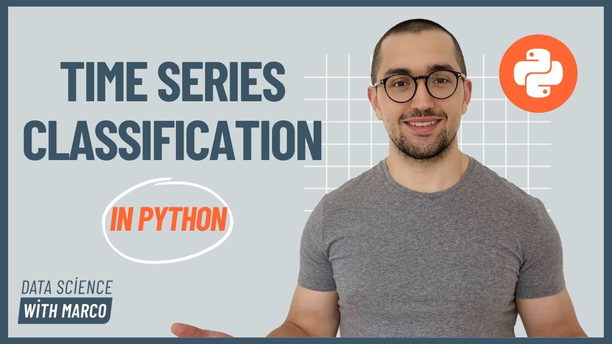

# Time Series Classification in Python 🚀



Master machine learning techniques for time series classification, in the most complete course on the subject, through hands-on projects and real-world applications.

## 👉 Not enrolled? Do it [right here](https://www.datasciencewithmarco.com/offers/soYA3CJW) 

## 🎯 What You'll Learn

Tackle any time series classification project by learning

- Advanced classification techniques for temporal data
- Flexible blueprint to apply deep learning architectures
- Feature engineering for time series classification
- Visualization techniques for time series data
- Capstone projects with full solutions using real-world applications, like sensor data, healthcare, spectroscopy and more.

## 💻 Getting Started

### Prerequisites

- Python 3.10+
- Anaconda to manage the virtual environment
- Basic understanding of machine learning concepts
- Familiarity with PyTorch or TensorFlow

### Environment Setup

1. Clone this repository:
```bash
git clone https://github.com/marcopeix/time-series-classification-in-python
cd time-series-classification-in-python
```

2. Create a virtual environment:
``` bash
conda env create -f environment.yml
```

## 📘 Course Content

This repository contains:

- all starter and solution notebooks for each lesson
- 📁 `data/`: sample datasets for practice and to download onlide data

## 🎓 Full Course Access

This repository only makes sense if you are enrolled in the course. 
By enrolling, you get:

- 6+ hours of video content
- Answers to all your questions
- Certificate of completion
- Lifetime access to course updates

👉 [Enroll in the full course](https://www.datasciencewithmarco.com/offers/soYA3CJW) 

## 📚 Additional Resources

- [Sktime documentation](https://www.sktime.net/en/stable/api_reference/classification.html)
- [Time series classificaton datasets directory](http://timeseriesclassification.com/dataset.php)

---
⭐️ If you find this repository helpful, please consider starring it!